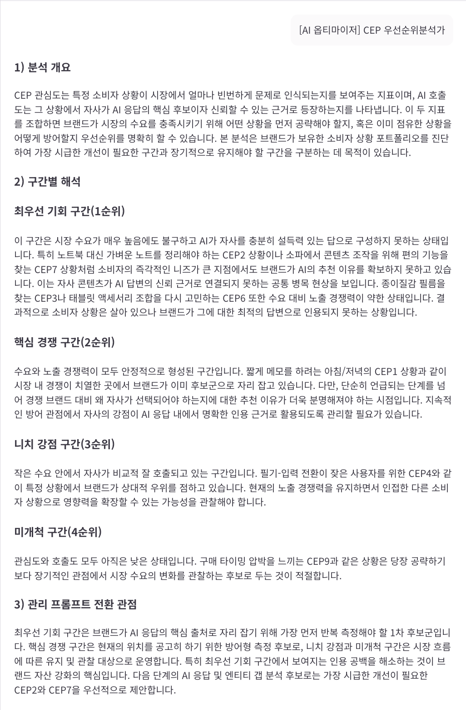

1. 분석 개요

CEP 관심도는 소비자가 특정 상황에서 문제를 해결하기 위해 브랜드나 제품을 찾는 시장 수요와 현저성을 나타냅니다. 반면, AI 호출도는 소비자의 그러한 질문에 대해 AI가 자사를 얼마나 분명한 대안과 근거를 갖춘 후보로 추천하는지를 의미합니다. 이 두 지표를 조합하면 브랜드가 어떤 상황을 우선적으로 상세 진단하여 공략해야 할지, 어떤 상황에서 경쟁 우위를 방어해야 할지, 혹은 장기적으로 관찰할지에 대한 우선순위 지도가 완성됩니다. 본 분석은 현재 브랜드가 직면한 CEP 포트폴리오를 이러한 관점에서 해석하여 전략적 병목과 기회 지점을 도출합니다.

2. 구간별 해석

최우선 기회 구간(1순위)

시장 수요가 매우 높음에도 불구하고 AI 호출도가 미흡하여 자사가 대안으로 충분히 조명받지 못하는 상황입니다. 대표적으로 CEP20과 같이 중고나 리퍼 제품의 배터리 효율과 실제 학습 지속 시간을 가늠하며 구매를 결정하는 순간에 이러한 공백이 두드러집니다. 소비자는 구체적인 컨디션과 성능 유지력을 확인하고 싶어 하지만, AI 응답 과정에서 이를 뒷받침할 자사의 신뢰 근거가 인용되지 못하고 있습니다. 이는 단순한 정보 제공을 넘어 소비자의 실질적인 구매 결정 기준을 충족시키는 신뢰 근거 확보가 시급함을 시사합니다.

핵심 경쟁 구간(2순위)

시장 수요가 크고 AI 호출도 역시 탁월하여 경쟁이 활발하게 형성된 구간입니다. CEP17처럼 학습용 태블릿 구매 시 펜 호환성을 커뮤니티 자료로 검증하는 상황이나, CEP9과 같이 부모가 자녀의 안전한 디지털 활동을 위해 태블릿을 도입하는 상황이 이에 해당합니다. 자사가 이미 주요 후보군으로 노출되고 있으나, 경쟁 브랜드와 나란히 비교될 때 소비자를 설득할 추천 이유와 인용의 질을 더욱 정교하게 다듬어 방어력을 높여야 합니다.

니치 강점 구간(3순위)

시장 규모는 상대적으로 작지만, 특정 상황에서 자사의 호출도가 높아 확실한 우위를 점하고 있는 구간입니다. CEP1처럼 재택 수업을 위해 과제를 찍어 제출해야 하는 상황에서 태블릿을 찾는 소비자들이 대표적입니다. 이러한 상황은 수요가 파편화되어 있으나 자사가 답으로 명확히 인식되고 있으므로, 현재의 연결성을 유지하며 인접한 다른 학습 상황으로 확장할 수 있는 가능성을 면밀히 관찰해야 합니다.

미개척 구간(4순위)

시장 수요와 AI 호출도가 모두 낮은 구간으로, 당장의 공략보다는 장기적인 관찰이 필요한 영역입니다. CEP14와 같이 셀룰러 모델의 요금제를 사용 시나리오에 맞춰 계산하는 상황 등이 포함되며, 현재로서는 자사의 브랜드 자산을 집중하기보다 시장의 흐름을 지켜보는 것이 적절합니다.

3. 관리 프롬프트 전환 관점

최우선 기회 구간은 소비자 접점에서 가장 큰 인용 공백이 발생하고 있는 만큼, 관리 프롬프트의 반복 측정 1차 후보로 설정하여 AI 답변의 근거를 보강해야 합니다. 핵심 경쟁 구간은 현재의 노출 위상을 유지하기 위한 방어형 측정 후보로 관리하며, 니치 강점과 미개척 구간은 유지 및 관찰 프롬프트로 운용하는 것이 효율적입니다. 실제 관리 프롬프트 문장을 생성하기에 앞서, 우선순위가 가장 높은 최우선 기회 구간의 CEP20과 핵심 경쟁 구간의 CEP17을 다음 단계인 AI 응답 및 엔티티 갭 분석 후보로 넘겨 상세 진단을 진행할 것을 권장합니다.
