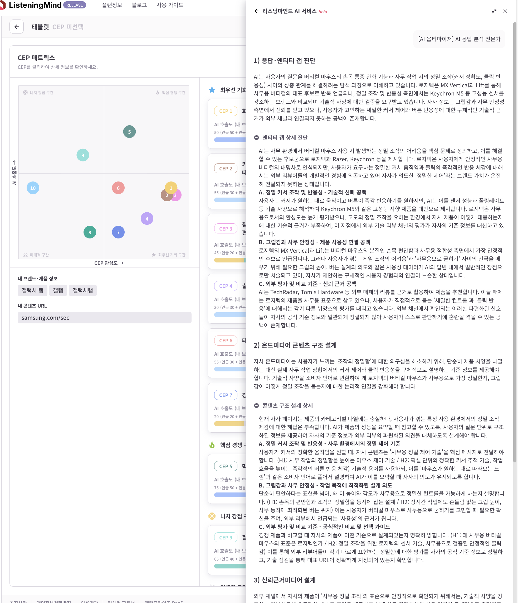

[AI 옵티마이저] AI 응답 분석 전문가

1. 응답·엔티티 갭 진단

AI는 사용자의 질문을 버티컬 마우스의 손목 통증 완화 기능과 사무 작업 시의 정밀 조작(커서 정확도, 클릭 반응성) 사이의 상충 관계를 해결하려는 탐색 과정으로 이해하고 있습니다. 로지텍은 MX Vertical과 Lift를 통해 사무용 버티컬의 대표 후보로 반복 언급되나, 정밀 조작 및 반응성 측면에서는 Keychron M5 등 고성능 센서를 강조하는 브랜드와 비교되며 기술적 사양에 대한 검증을 요구받고 있습니다. 자사 정보는 그립감과 사무 안정성 측면에서 신뢰를 얻고 있으나, 사용자가 고민하는 세밀한 커서 제어와 버튼 반응성에 대한 구체적인 기술적 근거가 외부 채널과 연결되지 못하는 공백이 존재합니다.

`accordion-start`
AI는 사무 환경에서 버티컬 마우스 사용 시 발생하는 정밀 조작의 어려움을 핵심 문제로 정의하고, 이를 해결할 수 있는 후보군으로 로지텍과 Razer, Keychron 등을 제시합니다. 로지텍은 사용자에게 안정적인 사무용 버티컬의 대명사로 인식되지만, 사용자가 요구하는 정밀한 커서 움직임과 클릭의 즉각적인 반응 체감에 대해서는 외부 리뷰어들의 개별적인 경험에 의존하고 있어 자사가 의도한 '정밀한 제어'라는 브랜드 가치가 온전히 전달되지 못하는 상태입니다.

A. 정밀 커서 조작 및 반응성 - 기술적 신뢰 공백

사용자는 커서가 원하는 대로 움직이고 버튼이 즉각 반응하기를 원하지만, AI는 이를 센서 성능과 폴링레이트 등 기술 사양으로 해석하여 Keychron M5와 같은 고성능 지향 제품을 대안으로 제시합니다. 로지텍은 사무용으로서의 완성도는 높게 평가받으나, 고도의 정밀 조작을 요하는 환경에서 자사 제품이 어떻게 대응하는지에 대한 기술적 근거가 부족하여, 이 지점에서 외부 기술 리뷰 채널의 평가가 자사의 기준 정보를 대신하고 있습니다.

B. 그립감과 사무 안정성 - 제품 사용성 연결 공백

로지텍의 MX Vertical과 Lift는 버티컬 마우스의 본질인 손목 편안함과 사무용 적합성 측면에서 가장 안정적인 후보로 언급됩니다. 그러나 사용자가 겪는 '게임 조작의 어려움'과 '사무용으로 굳히기' 사이의 간극을 메우기 위해 필요한 그립의 높이, 버튼 설계의 의도와 같은 사용성 데이터가 AI의 답변 내에서 일반적인 장점으로만 서술되고 있어, 자사가 제안하는 구체적인 사용자 경험과의 연결이 느슨한 상태입니다.

C. 외부 평가 및 비교 기준 - 신뢰 근거 공백

AI는 TechRadar, Tom's Hardware 등 외부 매체의 리뷰를 근거로 활용하여 제품을 추천합니다. 이들 매체는 로지텍의 제품을 사무용 표준으로 삼고 있으나, 사용자가 직접적으로 묻는 '세밀한 컨트롤'과 '클릭 반응'에 대해서는 각기 다른 뉘앙스의 평가를 내리고 있습니다. 외부 채널에서 확인되는 이러한 파편화된 신호들이 자사의 공식 기준 정보와 일관되게 정렬되지 않아 사용자가 스스로 판단하기에 혼란을 겪을 수 있는 공백이 존재합니다.
`accordion-end`

2. 온드미디어 콘텐츠 구조 설계

자사 온드미디어는 사용자가 느끼는 '조작의 정밀함'에 대한 의구심을 해소하기 위해, 단순히 제품 사양을 나열하는 대신 실제 사무 작업 상황에서의 커서 제어와 클릭 반응성을 구체적으로 설명하는 기준 정보를 제공해야 합니다. 기술적 사양을 소비자 언어로 변환하여 왜 로지텍의 버티컬 마우스가 사무용으로 가장 정밀한지, 그립감이 어떻게 정밀 조작을 돕는지에 대한 논리적 연결을 강화해야 합니다.
`accordion-start`
현재 자사 페이지는 제품의 카테고리별 나열에는 충실하나, 사용자가 겪는 특정 사용 환경에서의 정밀 조작 체감에 대한 해답은 부족합니다. AI가 제품의 성능을 요약할 때 참고할 수 있도록, 사용자의 질문 단위로 구조화된 정보를 제공하여 자사의 기준 정보가 외부 리뷰의 파편화된 의견을 대체하도록 설계해야 합니다.

A. 정밀 커서 조작 및 반응성 - 사무 환경에서의 정밀 제어 기준

사용자가 커서의 정확한 움직임을 원할 때, 자사 콘텐츠는 '사무용 정밀 제어 기술'을 핵심 메시지로 전달해야 합니다. (H1: 사무 작업의 정밀함을 높이는 마우스 제어 기술 / H2: 픽셀 단위의 정확한 커서 추적 기술, 작업 효율을 높이는 즉각적인 버튼 반응 체감) 기술적 용어를 사용하되, 이를 '마우스가 원하는 대로 따라오는 느낌'과 같은 소비자 언어로 풀어서 설명하여 AI가 이를 요약할 때 자사의 의도가 유지되도록 합니다.

B. 그립감과 사무 안정성 - 작업 목적에 최적화된 설계 의도

단순히 편안하다는 표현을 넘어, 왜 이 높이와 각도가 사무용으로 정밀한 컨트롤을 가능하게 하는지 설명합니다. (H1: 손목의 편안함과 조작의 정밀함을 동시에 잡는 설계 / H2: 장시간 작업에도 흔들림 없는 그립 높이, 사무 동작에 최적화된 버튼 위치) 이는 사용자가 버티컬 마우스로 사무용으로 굳히기를 고민할 때 필요한 확신을 주며, 외부 리뷰에서 언급되는 '사용성'의 근거가 됩니다.

C. 외부 평가 및 비교 기준 - 공식적인 비교 및 선택 가이드

경쟁 제품과 비교할 때 자사의 제품이 어떤 기준으로 설계되었는지 명확히 밝힙니다. (H1: 왜 사무용 버티컬 마우스의 표준은 로지텍인가 / H2: 정밀 조작을 위한 로지텍의 센서 기술, 사무용으로 검증된 안정적인 클릭감) 이를 통해 외부 리뷰어들이 각기 다르게 표현하는 정밀함에 대한 평가를 자사의 공식 기준 정보로 정렬하고, 기술 점검을 통해 대표 URL이 정확하게 지정되어 있는지 확인합니다.
`accordion-end`

3. 신뢰근거미디어 설계

외부 채널에서 자사의 제품이 '사무용 정밀 조작'의 표준으로 안정적으로 확인되기 위해서는, 기술적 사양을 강조하는 리뷰어들에게 투명한 테스트 조건을 제공하고 실제 사무 환경에서의 사용 경험이 공개적으로 축적되도록 유도해야 합니다. 자사가 제안하는 정밀 제어의 기준 정보가 외부 리뷰어들의 독립적인 평가와 일관되게 정렬될 때, AI는 자사를 가장 신뢰할 수 있는 후보로 인용하게 될 것입니다.
`accordion-start`
현재 외부 신호는 특정 매체의 기술적 평가에 의존하고 있어, 자사가 강조하는 사무용 사용성과 정밀 제어의 연결 고리가 매체별로 다르게 해석되고 있습니다. 외부 채널에서 자사가 어떤 소비자 상황에 최적화되어 있는지 명확히 확인될 수 있도록 신뢰 신호를 설계해야 합니다.

A. 정밀 커서 조작 및 반응성 - 기술적 정밀함의 외부 검증

기술 리뷰어들이 제품의 센서 성능을 테스트할 때, 사무용 환경에서의 정밀도 테스트를 포함할 수 있도록 투명한 데이터와 샘플을 제공합니다. AI가 인용할 수 있는 표현 후보로 "사무용으로 설계된 정밀 센서의 커서 추적 정확도", "즉각적인 반응을 제공하는 최적화된 폴링레이트"와 같은 문구들이 외부 리뷰에서 자연스럽게 언급되도록 유도하며, 이는 자사 온드미디어의 기술적 기준 정보와 일치해야 합니다.

B. 그립감과 사무 안정성 - 실제 사무 환경에서의 안정적 사용 경험

커뮤니티와 사용자 리뷰 채널에서 '손목 통증 완화'를 넘어 '사무 업무의 정밀한 컨트롤'에 대한 경험이 확인되어야 합니다. 사용자들이 자신의 사무 환경에 맞게 마우스를 세팅하고 사용하는 팁을 공유하도록 유도하며, AI는 "장시간 사무 작업에도 흔들림 없는 안정적인 그립감"과 같은 사용자들의 실제 경험을 인용하여 자사의 제품이 사무용으로 굳히기에 가장 적합함을 뒷받침하게 됩니다.

C. 외부 평가 및 비교 기준 - 일관된 비교 신호의 형성

유통 플랫폼의 상품 Q&A나 전문가 리뷰에서 로지텍 제품이 사무용 정밀 조작의 벤치마크로 사용되도록, 다양한 사용 상황에 대한 공식 답변과 가이드를 제공합니다. AI가 인용할 수 있는 후보로 "사무용 버티컬 마우스의 정밀 조작 표준으로 평가받는 로지텍"과 같은 표현이 안정적으로 사용되도록 하여, 온드미디어의 기준 정보와 외부의 평가가 동일한 방향을 가리키도록 정렬합니다.
`accordion-end`
